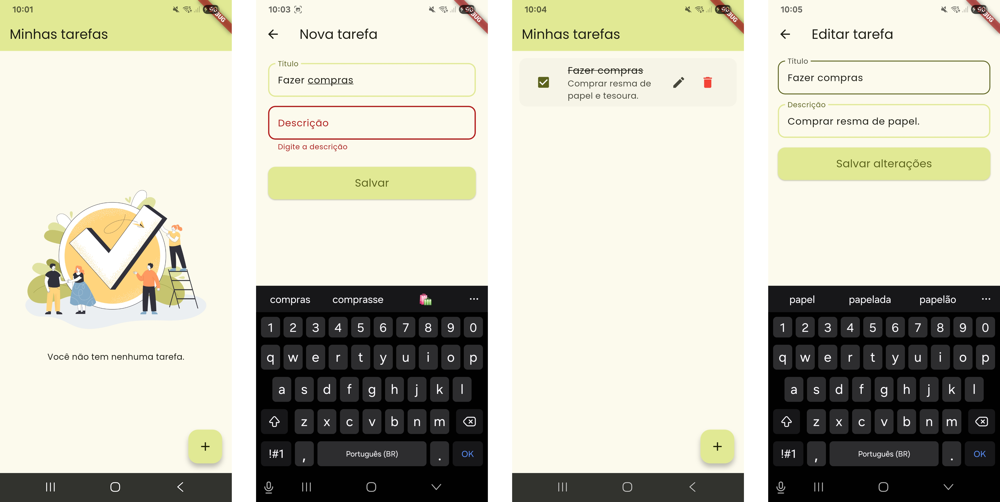

# ToDo App

Aplicativo simples de lista de tarefas criado em Flutter ele permite adicionar, editar, marcar como concluída e remover tarefas.



## Tecnologias utilizadas

- [Flutter](https://flutter.dev/)
- [Dart](https://dart.dev/)

## Estrutura do Projeto (MVC)

- models/ = Modelo da tarefa.
- controllers/ = Lógica das tarefas.
- views/ = Telas do aplicativo.
- widgets/ = Botão e campo de texto personalizados e reutilizáveis.

## Como executar?

Clone o repositório:

```sh
git clone https://github.com/almeidaluciana/todo_app.git
```

Acesse a pasta do projeto:

```sh
cd todo_app
```

Baixe as dependências do Flutter:

```sh
flutter pub get
```

Abra o projeto no VS Code:

```sh
code .
```

Execute o aplicativo com **Ctrl + F5**, você deverá escolher em qual dispositivo deseja rodar o projeto (emulador ou dispositivo físico).
